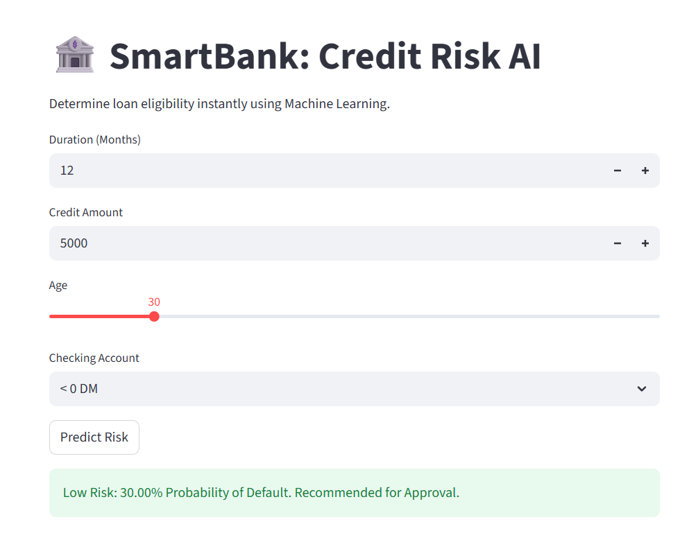

# 🏦 AI-Powered Credit Scoring System
(Demo_reject.png)

An end-to-end Machine Learning solution designed to predict the likelihood of loan default. This project features a robust Random Forest classifier and an interactive **Streamlit** dashboard for real-time risk assessment.

## 🚀 Overview
Financial institutions face significant risks when approving loans. This project implements a data-driven approach to minimize bad debt by identifying high-risk applicants using historical credit data.

### Key Features:
* **Predictive Modeling:** Uses a Random Forest Classifier trained on the German Credit Dataset.
* **Imbalance Handling:** Optimized for real-world scenarios where "defaults" are a minority class using **Cost-Sensitive Learning** (Balanced Class Weights).
* **Threshold Optimization:** Adjusted the decision boundary (0.34) to prioritize **Recall**, ensuring 70% of potential defaulters are caught.
* **Interactive Interface:** Built with Streamlit to allow loan officers to input data and receive instant verdicts.

---

## 🏗️ Technical Architecture

### 1. Data Processing & Feature Engineering
* **Handling Categorical Data:** Implemented One-Hot Encoding for features like `housing`, `purpose`, and `checking_account`.
* **Feature Scaling:** Utilized `StandardScaler` to normalize numerical features (Age, Amount, Duration), ensuring the model isn't biased by feature magnitude.

### 2. The Model Pipeline
* **Algorithm:** Random Forest (100+ decision trees).
* **Hyperparameter Tuning:** Optimized using `GridSearchCV` to find the best tree depth and split criteria.
* **Performance Metrics:**
    * **ROC-AUC Score:** 0.80 (Strong discriminative power)
    * **Optimized Recall:** 70% (Crucial for risk mitigation)

### 3. Deployment
The model and scaler are serialized using `joblib` for high-efficiency loading. The interface is built on Streamlit for a seamless user experience.

---

## 💻 How to Run Locally

1. **Clone the repository:**
   ```bash
   git clone [https://github.com/your-username/credit-scoring-ai.git](https://github.com/Rajneeshsingraul830/Credit-Scoring-ML-Dashboard.git)
   cd credit-scoring-ai